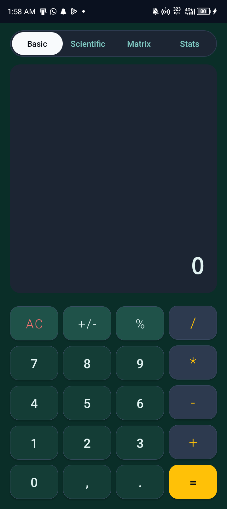
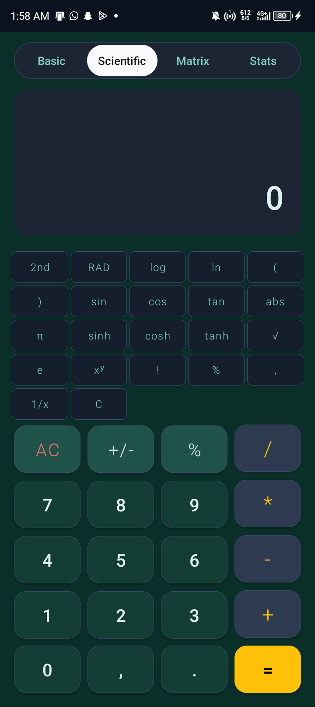
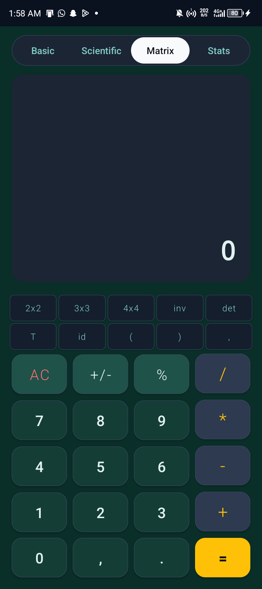

# Scientific Calculator - Sapphire & Gold Edition

A professional, feature-rich Android calculator with a custom "Liquid Sapphire & Gold" glass-style UI. This application supports basic arithmetic, advanced scientific functions, complex matrix operations, and statistical analysis.

## ✨ Features

### 🌙 Premium Design
* **Sapphire & Gold Theme**: A deep sapphire blue background with vibrant gold accents.
* **Glass UI Components**: Translucent display area and custom-styled glass buttons.
* **Animated Menu Selector**: A smooth, pill-style animated selector to switch between modes (Basic, Scientific, Matrix, Stats).
* **Spring Animations**: Haptic-like spring feedback on all button presses.

### 🧮 Calculation Modes
* **Basic Mode**: Standard arithmetic (+, -, *, /), percentage, and sign toggling.
* **Scientific Mode**: 
    * Trigonometry: `sin`, `cos`, `tan` (supports Radian/Degree modes).
    * Hyperbolic & Inverse: `sinh`, `asine`, etc. (accessible via **2nd** toggle).
    * Logarithms: `log`, `ln`.
    * Powers & Roots: `x²`, `xʸ`, `√`, `1/x`.
    * Constants: `π`, `e`.
* **Matrix Mode**: 
    * Supports up to 4x4 matrices with a dedicated template editor.
    * Operations: Addition, Subtraction, Multiplication, Inverse (`inv`), Determinant (`det`), Transpose (`T`), and Identity (`id`).
    * Input Format: Compact `[ 1 2; 3 4 ]` notation for complex expressions.
* **Statistics Mode**: 
    * Analyze datasets: `{ 1, 2, 3 }`.
    * Functions: `mean`, `stdDev`, `var` (variance), `sum`, `min`, `max`, and `count`.

## 🛠️ Tech Stack
* **Language**: Java
* **UI Framework**: Android XML with Material Design Components
* **Logic Engine**: Custom recursive descent parser for mathematical expressions.
* **Animations**: Android Property Animation API & Transition Framework.

## 🚀 Getting Started
1. Clone the repository:
   ```bash
   git clone https://github.com/Immanuel123-ctrl/Scientific_calculator.git
   ```
2. Open the project in **Android Studio**.
3. Sync Gradle and run the app on an emulator or physical device.

## 📸 UI Preview

<p align="center">
  
   
  
</p>

---
**Developed by [Immanuel123-ctrl](https://github.com/Immanuel123-ctrl)**
